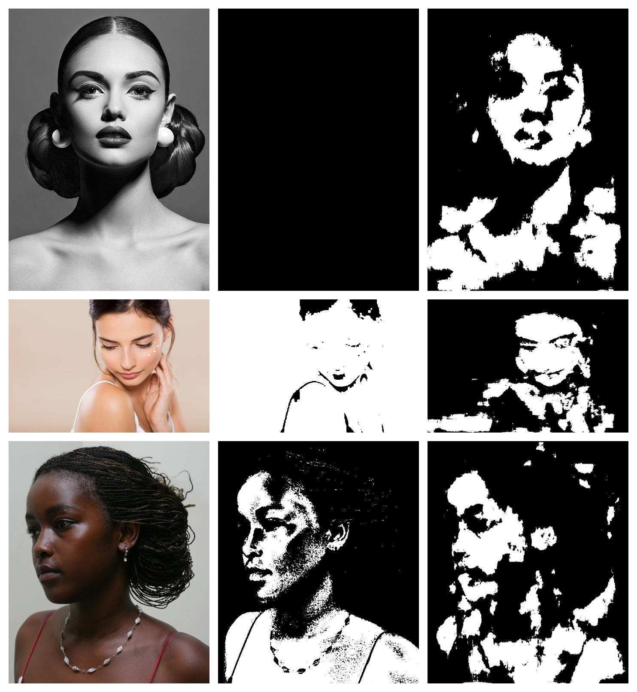

# Skin-Segmentation-TensorFlow
This is a modified [SegNet](https://arxiv.org/abs/1511.00561) convolutional neural net for segmenting human skin from images.
The model was trained on only 40 images, and while it manages an F1 score 0.90, it is in no way extremely generalizable, it was done as a simple project, to test if a CNN could be trained from scratch on a small dataset.

Dataset from [here](http://cs-chan.com/downloads_skin_dataset.html)

# Main Idea:
The code emphasizes readability, simplicity and ease of understanding. It is meant to be looked at if you are starting out with TensorFlow and looking into building your own model. There are only two files, one for data loading, and one for the model definition, training and testing.

# Examples:
 

Comparing with [Skin detection using HSV and YCbCr colorspace](https://github.com/quanghuy0497/Face-Skin-Detection). Left to right: Original images, skin detection images with colorspaces, skin segmentation images

